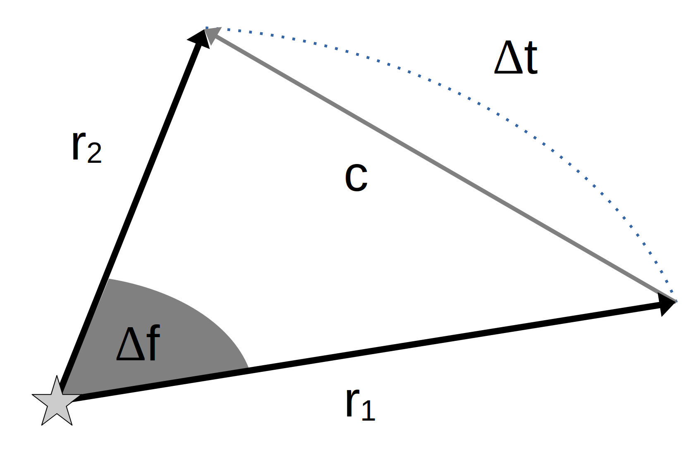

    
    Lamberts Problem
    
Gleich springen zur
        [<a href="./docs/paper.pdf">W-Seminar Arbeit</a>]
        [<a href="./docs/presentation.pdf">Präsentation</a>]
        [<a href="./docs/handout.pdf">Handout</a>]

 

> **Note:**  
> This project is in German. For an upcoming English version, check out my blog
> at [https://www.umcconnell.net/posts/](https://www.umcconnell.net/posts/) or
> skip to the literature recommendations (English):
> [Further Reading](#weiterführende-literatur)

## Inhaltsverzeichnis

-   [Übersicht](#übersicht)
-   [Dokumente](#dokumente)
-   [Code](#code)
-   [Gallerie](#gallerie)
-   [Weiterführende Literatur](#weiterführende-literatur)
-   [Lizenz (de)](#lizenz-de)
-   [License (en)](#license-en)
-   [Danksagung](#danksagung)

## Übersicht

Lamberts Problem bezeichnet die Bestimmung einer Umlaufbahn durch zwei Punkte,
die innerhalb einer vorgegebenen Flugzeit auf dieser Umlaufbahn verbunden
werden sollen.

<figure style="text-align:center">
    
    <figcaption>Abbildung 1: Geometrie des Problems</figcaption>
</figure>

Ursprünglich durch den Wissenschaftler Johann H. Lambert zur
Bestimmung von Kometenbahnen formuliert, wird die Lösung des Problems von
Lambert in der modernen Himmelsmechanik und Raumfahrt zum Beispiel zur Planung
interplanetarer Missionen oder zur Raketenabwehr verwendet.

## Dokumente

Übersicht der verfügbaren Dokumente:

-   [paper.pdf](./docs/paper.pdf) - W-Seminar Arbeit
-   [presentation.pdf](./docs/presentation.pdf) - Präsentation der Arbeit
-   [handout.pdf](./docs/handout.pdf) - Handout zur Präsentation

Interaktiv:

-   [Konstruktion der Transferellipse](https://www.geogebra.org/m/w4uycw6x) -
    Geogebra Applet
-   [Python Implementierung](./code/lambert.py) - siehe Anleitung unten

## Code

Eine Implementierung der Ergebnisse in Python3 ist auch verfügbar. Dazu wird
neben einer Python-Installation auch die SciPy Bibliothek
[numpy](https://numpy.org/install/) benötigt, sowie optional die SciPy
Bibliothek [matplotlib](https://matplotlib.org/) zur graphischen Darstellung der
Berechnungen. Installationsanleitungen finden sich auf der
[SciPy Webseite](https://scipy.org/) und den jeweiligen Projektseiten.

Das Python Skript kann heruntergeladen und ausgeführt werden:
[lambert.py](./code/lambert.py)

## Gallerie

<table width="100%" border="1">
    <tr>
        <td width="50%"></td>
        <td width="50%"></td>
    </tr>
    <tr>
        <td width="50%">Geometrie des Problems</td>
        <td width="50%">Originale Skizze Johann H. Lambert</td>
    </tr>
    <tr>
        <td width="50%"></td>
        <td width="50%"></td>
    </tr>
    <tr>
        <td width="50%">Skizze der Lagrange-Gleichung</td>
        <td width="50%">Beispielhafter Erde-Mars Transfer in 5 Monaten</td>
    </tr>
    <tr>
        <td width="50%"></td>
        <td width="50%"></td>
    </tr>
    <tr>
        <td width="50%">Mittlere Anomalie</td>
        <td width="50%">Mittlere Anomalie 2</td>
    </tr>
</table>

## Weiterführende Literatur

-   **An Introduction to the Mathematics and Methods of Astrodynamics**  
    \- Richard H. Battin, AIAA, 1999  
    mainly Chapter 6 and 7
-   **Lecture 10: Rendezvous and Targeting - Lambert's Problem.**  
    \- Matthew M. Peet, AEE 462: Spacecraft Dynamics and Control, 2021  
    Video:
    \[[Part A](https://www.youtube.com/watch?v=pjuXSlSOgI0)\]
    \[[Part B](https://www.youtube.com/watch?v=XltNtuw6P44)\]
    \[[Part C](https://www.youtube.com/watch?v=a3BWBYXi-IM)\]
    Lecture Notes:
    \[[Lecture 10](http://control.asu.edu/Classes/MAE462/462Lecture10.pdf)\]
-   **[Review of Lambert's Problem](https://arxiv.org/pdf/2104.05283.pdf)**  
    \- David de la Torre Sangrà and Elena Fantino, arxiv, 2021
-   **[The Application of Lambert's Theorem to the Solution of Interplanetary Problems](http://www.gravityassist.com/IAF1/Ref.%201-77.pdf)**  
    \- James F. Jordan, JPL, 1964
-   **[Revisiting Lambert’s problem](https://www.esa.int/gsp/ACT/doc/MAD/pub/ACT-RPR-MAD-2014-RevisitingLambertProblem.pdf)**  
    \- Dario Izzo, ESA, 2014

 

-   **[Biography of Johann H. Lambert](https://mathshistory.st-andrews.ac.uk/Biographies/Lambert/)**  
    \- J. J. O'Connor and E. F. Robertson, University of St. Andrews, 2004
-   **[Johann Heinrich Lambert and the Determination of Orbits for Planets and Comets](https://articles.adsabs.harvard.edu/pdf/1980CeMec..21..237V)**  
    \- Otto Volk, Celestial Mechanics, 1980

## Lizenz (de)

Wo nicht anders angegeben ist dieses Projekt unter der
[MIT Lizenz](./LICENSE.md) lizensiert.

Die Arbeit, die Präsentation und das Handout sind lizensiert
unter einer
<a
rel="license"
href="http://creativecommons.org/licenses/by-nc-sa/4.0/">Creative Commons Namensnennung–Nicht-
kommerziell–Weitergabe unter gleichen Bedingungen 4.0 International</a>
 Lizenz.

## License (en)

Where not stated otherwise, this project is licensed under the
[MIT License](./LICENSE.md).

The paper, the presentation, and the handout are licensed under a
<a
rel="license"
href="http://creativecommons.org/licenses/by-nc-sa/4.0/">Creative
Commons Attribution-NonCommercial-ShareAlike 4.0 International License</a>
.

## Danksagung

-   [TeX Live](https://tug.org/texlive/) - Implementierung von TeX-Systemen
    ([Lizenz](https://tug.org/texlive/copying.html))
-   [beamer](https://github.com/josephwright/beamer) - Latex Klasse zur
    Erstellung von Präsentationen
    ([LPPL und GPL Lizenz](https://github.com/josephwright/beamer/blob/main/LICENSE.md))
-   [biblatex](https://www.ctan.org/pkg/biblatex) - Literaturverwaltungsprogramm
    ([LPPL Lizenz](https://github.com/plk/biblatex#copyright-and-licence))
-   [arxiv-style](https://github.com/kourgeorge/arxiv-style) - Layout der Arbeit
    ([MIT Lizenz](https://github.com/kourgeorge/arxiv-style/blob/master/License.txt))
-   [metropolis](https://github.com/matze/mtheme) - Layout der Präsentation
    ([CC BY SA 4.0](https://github.com/matze/mtheme#license))
